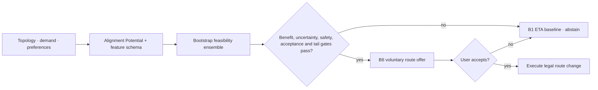
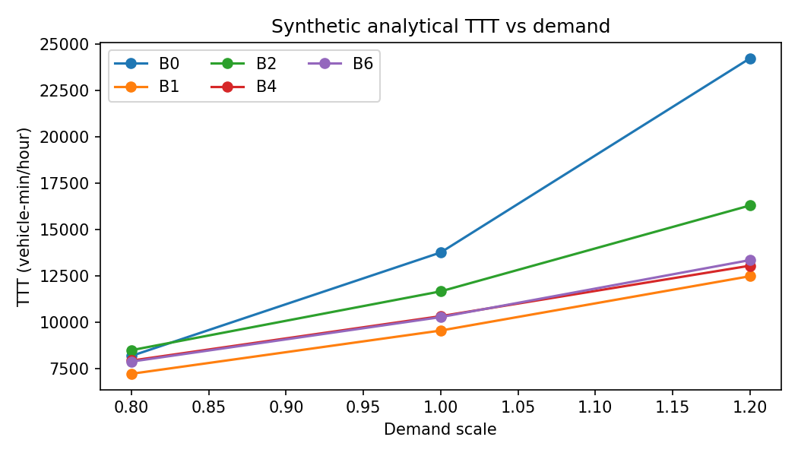
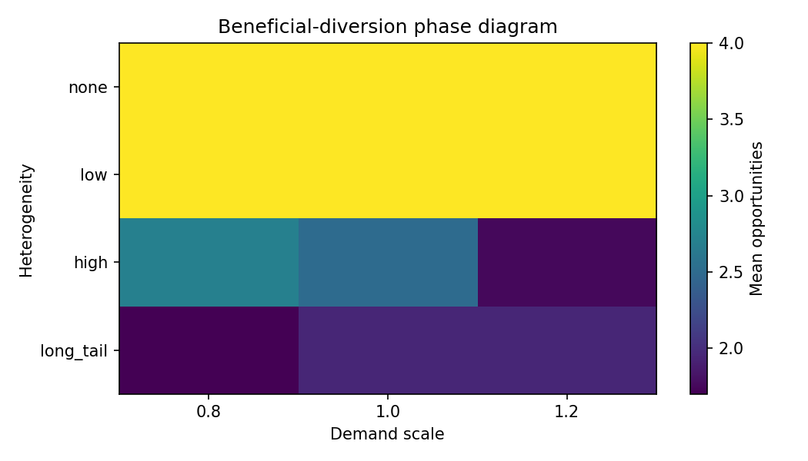

<p align="center">
  
</p>

<p align="center">
  <strong>Alignment-feasibility-gated, safety-constrained adaptive navigation.</strong><br />
  Predict when voluntary route coordination is worth attempting—and abstain when it is not.
</p>

<p align="center">
  
  
  
  
  
</p>

<p align="center">
  <a href="#system">System</a> ·
  <a href="#architecture">Architecture</a> ·
  <a href="#reproduce">Reproduce</a> ·
  <a href="#research-status">Research status</a> ·
  <a href="#evidence">Evidence</a>
</p>

---

> [!IMPORTANT]
> CONCORDIA recommends legal routes using truthful computed attributes. It never controls
> speed, steering, acceleration, or lane changes. A route is changed only after the modeled
> user explicitly accepts the offer. If feasibility, uncertainty, benefit, acceptance, tail,
> or safety gates fail, v3 leaves the ETA baseline route unchanged.

## System

CONCORDIA v3 asks a narrower, harder question: under which topology, demand, and preference
conditions is voluntary coordination likely to help? It estimates alignment feasibility before
acting, applies B6 only to high-confidence opportunities, and otherwise falls back to B1.

| Behavioral layer | Adaptive layer | Research layer |
|---|---|---|
| Independent route choice and acceptance | Dynamic state and horizon prediction | B0–B6 matched policy comparisons |
| Population prior and user posterior | Multi-objective candidate generation | Paired seeds, bootstrap CI, effect sizes |
| Pairwise learning and preference drift | Acceptance-aware receding-horizon MPC | SUMO/SSM and real OSM verification |
| Accepted-only route execution | Exact, greedy, HiGHS MIP, and MPC baselines | Mandatory quantitative RL gate |

### What is implemented

- Explicit `RouteOffer` → `RecommendationDecision` → `AcceptanceOutcome` domain stages.
- Count, density, flow, speed, and occupancy state with documented units and provenance.
- ETA, reliability, cost, risk, complexity, and familiarity route candidates with overlap and
  Pareto filtering.
- Dynamic route attributes and Preference Slack over a projected traffic horizon.
- Closed-loop MPC that offers only its first action, observes again, and never executes a
  rejected recommendation.
- Separate phantom-jam risk predictor and multi-event trajectory detector.
- TTC, PET, DRAC, hard-braking, SSM conflict typing, and direction-aware safety-tail metrics.
- Original-geometry OSM import, topology audit, SUMO conversion, and QGIS-ready GeoJSON.
- Immutable run manifests containing commit/dirty state, timing, versions, hardware, seeds,
  validity, and input/output hashes.
- A 32-feature alignment-feasibility schema with Alignment Potential, topology, preference,
  acceptance, predicted benefit, uncertainty, and safety-margin inputs.
- Frozen selective decision thresholds, B1 fallback, risk–coverage metrics, and complete
  decision logs explaining every intervention or abstention.

## Architecture



The analytical layer is a BPR correctness harness. The microscopic layer is actual SUMO
1.27.1 through TraCI. They are never silently substituted for one another.

## Reproduce

```bash
make setup
make lint
make test
make benchmark
make experiment
make research
make simulation-test
make phantom-calibrate
make alignment-study
make microscopic-study
make real-topology-study
make scalability-study
make drift-study
make rl-gate
make rl-evaluate
make report-v2
make audit-v2

# v3 preregistered sequence
make v3-audit
make v3-dataset
make feasibility-train
make feasibility-validate
make freeze-thresholds
make v3-holdout
make v3-microscopic
make v3-real-topology
make v3-tail-study
make v3-report
make v3-final-audit
```

Install the official SUMO/TraCI optional dependencies before microscopic validation:

```bash
python3 -m pip install -e '.[dev,analysis,sumo]'
```

The fast test suite does not open SUMO. CI separates analytical, microscopic, and manually
dispatched research-matrix workflows.

## Research status

The v3 primary evaluation contains **288 untouched holdout cases**. Frozen V3-D intervened in
15 cases: precision **53.3%** (95% CI **30.1–75.2%**), coverage **5.2%**, positive mean TTT
gain, and zero regret/safety/legal violations among interventions. This is **Outcome P**:
point precision exceeded 50%, but the 65% engineering target, 40% coverage target, and lower-CI
scientific criterion were not met.

| v3 hypothesis | Status | Finding |
|---|---|---|
| H8 · Intervention precision exceeds chance | **FAIL / point PASS** | Point estimate was 53.3%; lower 95% bound was 30.1%. |
| H9 · Selectivity reduces failed interventions | **PASS** | Failure avoidance was 96.3% versus always-on B6. |
| H10 · Network cost and tail remain bounded | **PASS** | Mean gain was positive; stressed degradation CVaR was 0.00175 ≤ 0.10. |
| H11 · Safety gate avoids unsafe recommendations | **PASS** | SUMO B6 had 6/6 safety failures; v3 abstained from all six. |
| H12 · Positive real-topology selective benefit | **FAIL** | V3 safely abstained from all six cases but produced no positive benefit. |
| H13/H14 · Topology and diversity interactions | **DESCRIPTIVE** | Synthetic holdout correlations were 0.262 and 0.204. |

### Preserved v2 outcomes

The original v2 failures are not rewritten by v3. They remain development context:

| Hypothesis | Status | Finding |
|---|---|---|
| H1 · Preference diversity creates more diversion opportunities | **FAIL** | Not supported by the declared synthetic population and routes. |
| H2 · B6 reduces TTT under bounded regret | **FAIL** | B6 respected the regret bound but did not beat B1 in aggregate. |
| H3 · Adaptive routing prevents phantom jams | **FAIL** | In 60 matched pairs, VALID-event probability was B1=0.033 and B6=0.100 (exact McNemar p=0.289). |
| H4 · Safety tails do not degrade | **FAIL** | DRAC-CVaR non-inferiority was not established: B6−B1 mean 0.183, upper 95% bootstrap bound 0.464 > 0.25 margin. |
| H5 · Variance/tails explain more than means | **PARTIAL** | Exploratory in-sample association only. |
| H6 · Closed-loop feedback is more stable | **FAIL** | No pre-registered stability effect was met. |
| H7 · RL exceeds constrained MPC | **TESTED / REJECTED** | Gate-authorized RL0 did not outperform the constrained deterministic comparator. |

The signalized scenario exposes an important failure condition: ETA-only can lower network TTT
while exceeding some users' regret budget. CONCORDIA reports that trade-off instead of hiding
it behind an aggregate objective.

### Microscopic and real-topology boundary

- The v3 SUMO metastable search completed 21 B1 runs with 2,967/2,967 arrivals. It found no
  positive VALID-event runs, so the separate phantom predictor remains **NOT CALIBRATED** and
  its gate is excluded.
- The unseen-OD OSM study completed 12 B1/B6 runs with 600/600 arrivals and three legal paths.
  High route overlap accompanied six B6 failures; v3 preserved B1 in all six cases.
- The paired SUMO matrix completed 120 runs and 60 B1/B6 pairs; all 11,960 generated vehicles
  arrived. Only physically VALID events count toward H3.
- Of 45 event candidates, 8 met the three-detector physical validation contract. Predictor
  calibration remains **FAILED / NOT CALIBRATED** because the held-out seed did not contain
  both VALID-event classes.
- The Gangnam-area OSM experiment completed 20 B1/B6 runs on three legal alternatives and
  1,000/1,000 arrivals. B6 increased mean transfer TTT by about 3.8%; its OD remains explicitly
  **synthetic demand on real topology**.
- Surrogate conflicts are never interpreted as crash probabilities.

### RL decision

> **Outcome B — Gate B authorized RL0 after the fixed-point-aware exact cycle exceeded its
> frozen runtime threshold. Compact eligibility-only PPO was evaluated, matched the constrained
> deterministic comparator on held-out TTT, and was rejected because it was not superior.**

RL0 had zero regret/safety violations and microsecond inference, but speed alone was not enough
to retain it when the deterministic approximation already met operational limits. The drift p95
remains a recorded failure tail even though median Gate C did not trigger.

## Evidence

<table>
  <tr>
    <td width="50%"></td>
    <td width="50%"></td>
  </tr>
  <tr>
    <td align="center"><sub>Synthetic analytical TTT across B0–B6</sub></td>
    <td align="center"><sub>Screened opportunity surface—not a real-world effect map</sub></td>
  </tr>
</table>

| Artifact | Contents |
|---|---|
| [`FINAL_AUDIT_V3.md`](FINAL_AUDIT_V3.md) | Leakage, freeze, targets, H8–H14, evidence boundaries, and Outcome P |
| [`artifacts/report.html`](artifacts/report.html) | Current v3 paper-style report with holdout, SUMO, OSM, and stress evidence |
| [`v3_feasibility_prediction/summary.json`](artifacts/studies/v3_feasibility_prediction/summary.json) | Development-only model selection, calibration, feature importance, and frozen candidate |
| [`v3_selective_holdout/summary.json`](artifacts/studies/v3_selective_holdout/summary.json) | Untouched 288-case primary holdout and Outcome P |
| [`v3_microscopic_selective/summary.json`](artifacts/studies/v3_microscopic_selective/summary.json) | Actual SUMO safety-selectivity and phantom calibration exclusion |
| [`v3_real_topology_selective/summary.json`](artifacts/studies/v3_real_topology_selective/summary.json) | Unseen synthetic OD on real OSM geometry and selective fallback |
| [`v3_tail_robustness/summary.json`](artifacts/studies/v3_tail_robustness/summary.json) | Frozen post-holdout demand/preference stress evaluation |
| [`FINAL_AUDIT_V2.md`](FINAL_AUDIT_V2.md) | Final completion checks and evidence-based hypothesis outcomes |
| [`artifacts/reports/final_report_v2.html`](artifacts/reports/final_report_v2.html) | Alignment, microscopic, real-topology, scalability, and RL paper-style report |
| [`alignment_frontier/summary.json`](artifacts/studies/alignment_frontier/summary.json) | Price of Alignment, knee uncertainty, and WIN/TRADEOFF/INFEASIBLE map |
| [`microscopic_policy_matrix/summary.json`](artifacts/studies/microscopic_policy_matrix/summary.json) | 120 actual SUMO runs, H3 paired events, and H4 DRAC-CVaR non-inferiority |
| [`phantom_calibration/summary.json`](artifacts/studies/phantom_calibration/summary.json) | Leakage-safe held-out calibration attempt and explicit failure reason |
| [`real_topology_policy_matrix/summary.json`](artifacts/studies/real_topology_policy_matrix/summary.json) | Actual B1/B6 SUMO transfer on Gangnam geometry with synthetic demand |
| [`scalability/summary.json`](artifacts/studies/scalability/summary.json) | Enumeration boundary, approximation runtime/memory, and Gate E |
| [`preference_drift/summary.json`](artifacts/studies/preference_drift/summary.json) | Nonstationarity performance, tail behavior, and Gate C |
| [`artifacts/rl_gate_report_v2.json`](artifacts/rl_gate_report_v2.json) | Frozen A–E reevaluation and Outcome B |
| [`conditional_rl/summary.json`](artifacts/studies/conditional_rl/summary.json) | Gate-authorized held-out PPO evaluation and Outcome B rejection |
| [`analytical_matrix/summary.json`](artifacts/studies/analytical_matrix/summary.json) | Screening, focused B0–B6 rows, paired statistics, and failure cases |
| [`analytical_matrix/manifest.json`](artifacts/studies/analytical_matrix/manifest.json) | Clean source commit, runtime, dependencies, and hashes |
| [`sumo_ring/summary.json`](artifacts/studies/sumo_ring/summary.json) | Microscopic traffic, wave candidates, safety distributions, and claim boundary |
| [`sumo_ring/manifest.json`](artifacts/studies/sumo_ring/manifest.json) | Clean source commit, SUMO version, inputs, runtime, and output hashes |
| [`real_topology/topology_audit.json`](artifacts/studies/real_topology/topology_audit.json) | OSM topology, components, route diversity, and demand provenance |
| [`docs/mathematical_spec.md`](docs/mathematical_spec.md) | Units, utility, constraints, MPC, safety, and scientific assumptions |

## Repository map

```text
assets/        Figma-derived Concordia brand assets
configs/       scenario, population, policy, screening, and focused experiment inputs
data/          immutable OSM source, processed geometry, and provenance manifests
docs/          mathematical specification, decisions, gap audit, and RL gate decision
src/concordia/ behavior, adaptive loop, optimization, simulation, traffic, safety, GIS
tests/         unit, property-style, integration, regression, and golden scenarios
experiments/   candidate factor-space declaration
scripts/       SUMO and real-topology verification helpers
artifacts/     phase reports, study evidence, figures, registry, gate, and report
```

---

<p align="center">
  <sub>Safety metrics are surrogate conflict indicators, never accident probabilities.<br />
  Synthetic preference and acceptance coefficients are assumptions, not calibrated human behavior.</sub>
</p>
