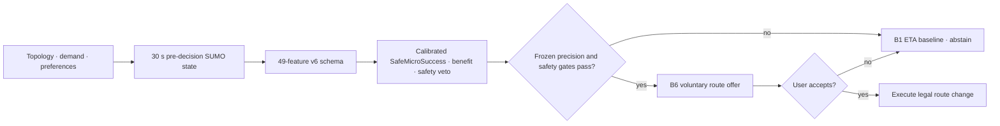

<p align="center">
  
</p>

<p align="center">
  <strong>SUMO-native, safety-gated selective adaptive navigation.</strong><br />
  Predict SafeMicroSuccess from pre-decision traffic state—or preserve the ETA baseline when the evidence is insufficient.
</p>

<p align="center">
  
  
  
  
  
</p>

<p align="center">
  <a href="#system">System</a> ·
  <a href="#architecture">Architecture</a> ·
  <a href="#reproduce">Reproduce</a> ·
  <a href="#research-status">Research status</a> ·
  <a href="#evidence">Evidence</a>
</p>

---

> [!IMPORTANT]
> CONCORDIA recommends legal routes using truthful computed attributes. It never controls
> speed, steering, acceleration, or lane changes. A route is changed only after the modeled
> user explicitly accepts the offer. v6 predicts the joint SafeMicroSuccess label from 49 strictly
> pre-decision features and otherwise leaves the ETA baseline route unchanged. Development
> validation found no non-empty point satisfying precision ≥80% with zero safety violations, so
> the frozen v6 package safely abstains. Its final result is Outcome F, not a deployment claim.

## System

CONCORDIA v6 asks whether an actual-SUMO-native classifier can recover safe microscopic
opportunities that v5 missed while retaining at least 80% precision and zero safety violations.
It uses analytical prediction only as a recall-oriented screening feature, learns the joint
SafeMicroSuccess outcome directly, compares composite and independent safety-veto architectures,
and otherwise falls back to B1.

| Behavioral layer | Adaptive layer | Research layer |
|---|---|---|
| Independent route choice and acceptance | Dynamic state and horizon prediction | B0–B6 matched policy comparisons |
| Population prior and user posterior | Multi-objective candidate generation | Paired seeds, bootstrap CI, effect sizes |
| Pairwise learning and preference drift | Acceptance-aware receding-horizon MPC | SUMO/SSM and real OSM verification |
| Accepted-only route execution | Exact, greedy, HiGHS MIP, and MPC baselines | Mandatory quantitative RL gate |

### What is implemented

- Explicit `RouteOffer` → `RecommendationDecision` → `AcceptanceOutcome` domain stages.
- Count, density, flow, speed, and occupancy state with documented units and provenance.
- ETA, reliability, cost, risk, complexity, and familiarity route candidates with overlap and
  Pareto filtering.
- Dynamic route attributes and Preference Slack over a projected traffic horizon.
- Closed-loop MPC that offers only its first action, observes again, and never executes a
  rejected recommendation.
- Separate phantom-jam risk predictor and multi-event trajectory detector.
- TTC, PET, DRAC, hard-braking, SSM conflict typing, and direction-aware safety-tail metrics.
- Original-geometry OSM import, topology audit, SUMO conversion, and QGIS-ready GeoJSON.
- Immutable run manifests containing commit/dirty state, timing, versions, hardware, seeds,
  validity, and input/output hashes.
- A 46-feature v4 schema that preserves the v3 prefix and adds route-count, bottleneck,
  preference-slack, dispersion, capacity, demand, penetration, and safety interactions.
- Raw/Platt/isotonic/beta probability calibration, lower-bound benefit regression, conservative
  safety UCB prediction, conformal comparison, and risk-adjusted ESIV.
- Five families of leave-group-out CV, precision-constrained threshold selection, an explicit
  coverage guard, immutable model/threshold checksums, and complete decision logs.
- A 50-feature v5 schema with penetration × APS/capacity/overlap and DSS × penetration terms.
- Learned regime routing, robust median/MAD domain-shift scoring, per-regime calibration, and
  regime/shift-specific frozen thresholds.
- Seed-disjoint actual-SUMO micro development (60/20/20) plus a 100-pair untouched final holdout.
- Five frozen v5 YAML packages and a manifest covering 104 deployment-code checksums and nine
  learned artifacts before any final holdout was materialized.
- A 49-feature v6 schema spanning static/temporal traffic state, topology, preference slack,
  navigation penetration, microscopic safety proxies, and analytical screening signals.
- 600 seed-family-disjoint paired development cases (1,200 actual SUMO runs), with 360/120/120
  train/calibration/validation roles and zero pairing or future-state leakage failures.
- Logistic, interaction, gradient-boosted tree, random-forest, regime-specific, and hierarchical
  candidates; Platt/isotonic/beta calibration; classical and conformal selective frontiers.
- Five frozen v6 packages plus a code/artifact checksum manifest created before 512 analytical,
  200 microscopic, and 80 real-OSM paired final conditions were materialized.

## Architecture



The analytical layer is a BPR correctness harness. The microscopic layer is actual SUMO
1.27.1 through TraCI. They are never silently substituted for one another.

## Reproduce

```bash
make setup
make lint
make test
make benchmark
make experiment
make research
make simulation-test
make phantom-calibrate
make alignment-study
make microscopic-study
make real-topology-study
make scalability-study
make drift-study
make rl-gate
make rl-evaluate
make report-v2
make audit-v2

# v3 preregistered sequence
make v3-audit
make v3-dataset
make feasibility-train
make feasibility-validate
make freeze-thresholds
make v3-holdout
make v3-microscopic
make v3-real-topology
make v3-tail-study
make v3-report
make v3-final-audit

# v4 preregistered sequence
make v4-audit
make v4-dataset
make v4-train
make v4-robust-cv
make v4-calibrate
make v4-benefit-model
make v4-safety-model
make v4-select-threshold
make v4-freeze
make v4-holdout
make v4-microscopic
make v4-real-topology
make v4-stress
make v4-report
make v4-final-audit

# v5 preregistered sequence
make v5-audit
make v5-dataset
make v5-regime-discovery
make v5-train
make v5-shift-model
make v5-calibrate
make v5-micro-dataset
make v5-micro-correction
make v5-safety-veto
make v5-validate
make v5-freeze
make v5-holdout
make v5-microscopic
make v5-real-topology
make v5-stress
make v5-report
make v5-final-audit

# v6 SUMO-native preregistered sequence
make v6-audit
make v6-micro-design
make v6-micro-dataset
make v6-label
make v6-train
make v6-temporal-model
make v6-safety-model
make v6-calibrate
make v6-select-threshold
make v6-validate
make v6-freeze
make v6-analytical-holdout
make v6-microscopic-holdout
make v6-real-topology
make v6-failure-analysis
make v6-report
make v6-final-audit
```

Install the official SUMO/TraCI optional dependencies before microscopic validation:

```bash
python3 -m pip install -e '.[dev,analysis,sumo]'
```

The fast test suite does not open SUMO. CI separates analytical, microscopic, and manually
dispatched research-matrix workflows.

## Research status

v6 used **600 paired development cases / 1,200 actual SUMO runs**, including 101
SafeMicroSuccess labels. No non-empty validation operating point satisfied both 80% precision and
zero safety violations; the best diagnostic point reached 60% precision with two safety
violations. The pre-registered fallback therefore froze a safe-abstention policy before final data.

On the **200-pair untouched microscopic holdout**, 37 counterfactual safe opportunities existed,
but frozen V6-F intervened zero times: precision 0 by non-empty-claim convention, coverage 0,
ORR 0, and zero safety violations. Always-on B6 had 18.5% precision and 36 safety violations;
historical V5-F reached 45.5% precision over 11 interventions. The frozen analytical reference
retained 84.7% precision over 59/512 interventions, but microscopic evidence is primary.

The real-topology bridge used **10 stratified Gangnam OSM OD pairs**, 80 paired conditions, and
240 SUMO runs including pre-decision probes. Seven counterfactual safe opportunities existed;
V6-F safely abstained from all of them. The final decision is **Outcome F**.

| v6 hypothesis | Status | Finding |
|---|---|---|
| H29 · v6 improves microscopic precision over V5-F | **NOT ESTIMABLE / FAIL** | v6 made no interventions; V5-F precision was 45.5%. |
| H30 · Microscopic precision ≥80% | **FAIL** | No eligible non-empty policy was frozen. |
| H31 · Opportunity Recovery Rate ≥40% | **FAIL** | Final ORR was 0%. |
| H32 · Final microscopic safety violations are zero | **PASS** | Safe abstention executed only B1. |
| H33 · Temporal features improve prediction | **ABLATION-TESTED** | Development-only ablation is preserved; it did not change the claim. |
| H34 · Analytical score adds micro information | **ABLATION-TESTED** | Development-only ablation is preserved; final outcomes were never reused. |
| H35 · Penetration modifies microscopic success | **DESCRIPTIVE** | Stratified development rates vary; no causal claim is made. |
| H36 · At least one safe OSM intervention | **FAIL** | 0 interventions and 0 recovered safe successes. |

### Preserved v5 outcome

The v5 primary analytical holdout contains **1,024 untouched cases**. Frozen V5-RD intervened
in 132 cases: precision **82.6%**, coverage **12.9%**, and zero analytical safety violations.
The precision and 75-intervention requirements passed, as did worst critical-group precision
(**74.0%**), but coverage missed the preregistered 15% acceptable threshold. The 256-case unseen
stress holdout passed at **85.2%** precision and **10.5%** coverage with zero safety violations.

The final actual-SUMO bridge is decisive: on 100 untouched paired conditions, V5-F made 10
interventions, succeeded once, and allowed one surrogate safety violation (false-safe **10%**).
On six legal Gangnam OSM OD pairs and 48 paired conditions it abstained everywhere. Because a
microscopic safety failure independently forces rejection, the final decision is **Outcome F**.

| v5 hypothesis | Status | Finding |
|---|---|---|
| H21 · Regime conditioning improves the global policy | **PASS, SMALL** | Frozen V5-R slightly improved precision and coverage over V5-G. |
| H22 · DSS improves shifted robustness | **FAIL** | Stress safety remained clean, but precision did not improve over no-DSS. |
| H23 · Microscopic safety gate improves safety | **FAIL / OVER-CONSERVATIVE** | It zeroed analytical activation and still admitted one microscopic false-safe case. |
| H24 · Microscopic correction improves benefit prediction | **FAIL** | Final MAE slightly worsened from 0.05455 to 0.05470. |
| H25 · Full policy achieves safe microscopic success | **FAIL** | Precision 10%, one safe success, one safety violation. |
| H26 · Selectivity is a safety/transfer mechanism | **PARTIAL** | It removed 24/25 unsafe B6 adaptations, but not the final one. |
| H27 · Hierarchical/mixture modeling is more robust | **FAIL** | Selection chose regime-specific M3 instead. |
| H28 · Penetration interactions improve robust validation | **FAIL** | Coverage and Brier score did not jointly improve. |

One descriptive microscopic TTT aggregation incorrectly populated abstained rows with B6 deltas.
The frozen raw result is preserved; `FINAL_AUDIT_V5.md` recomputes the selected-policy population
mean from immutable pairs. Decisions, precision, coverage, success, and safety labels are unchanged.

### Preserved v4 outcome

The v4 primary evaluation contains **640 untouched holdout cases**. Frozen V4-P intervened in
55 cases: precision **87.3%** (95% CI **76.0–93.7%**), coverage **8.6%**, positive mean TTT
gain, and zero regret/safety/legal violations among analytical interventions. Precision, the
50-intervention target, and both scientific lower-CI criteria passed. Coverage missed the 20%
minimum and the preregistered validation guard had already blocked deployment. The final decision
is therefore **Outcome P**, not S or S+.

| v4 hypothesis | Status | Finding |
|---|---|---|
| H15 · Holdout precision ≥80% | **PASS** | 48/55 interventions succeeded; lower 95% bound was 76.0%. |
| H16 · Coverage improves and reaches 20% | **PARTIAL** | 8.6% exceeded V3-D's historical holdout coverage but missed 20%. |
| H17 · Analytical safety violations are zero | **PASS** | No analytical safety, regret, or legal violations among interventions. |
| H18 · Population benefit rate improves | **PASS** | Holdout PBR was 7.5%, above historical V3-D. |
| H19 · Heterogeneity × route diversity generalizes | **DESCRIPTIVE** | Validation log-loss improved slightly, but the approximate coefficient CI crossed zero. |
| H20 · ESIV improves Coverage@Precision80 | **FAIL** | ESIV and probability gating both reached 4.2% on validation. |

Worst activated-group precision was **40.0%** at 50% navigation penetration, despite a median
activated-group precision of **89.7%**. Isotonic validation ECE was **0.0514**, narrowly missing
the 0.05 target. Under post-holdout demand/preference/acceptance shift, precision fell to
**44.1%** at **17.2%** coverage, although safety violations remained zero.

### Preserved v3 outcome

The v3 primary evaluation remains **Outcome P**: 15 interventions on 288 untouched cases,
precision **53.3%** (95% CI **30.1–75.2%**), coverage **5.2%**, positive mean TTT gain, and
zero regret/safety/legal violations. v4 does not rewrite that result.

| v3 hypothesis | Status | Finding |
|---|---|---|
| H8 · Intervention precision exceeds chance | **FAIL / point PASS** | Point estimate was 53.3%; lower 95% bound was 30.1%. |
| H9 · Selectivity reduces failed interventions | **PASS** | Failure avoidance was 96.3% versus always-on B6. |
| H10 · Network cost and tail remain bounded | **PASS** | Mean gain was positive; stressed degradation CVaR was 0.00175 ≤ 0.10. |
| H11 · Safety gate avoids unsafe recommendations | **PASS** | SUMO B6 had 6/6 safety failures; v3 abstained from all six. |
| H12 · Positive real-topology selective benefit | **FAIL** | V3 safely abstained from all six cases but produced no positive benefit. |
| H13/H14 · Topology and diversity interactions | **DESCRIPTIVE** | Synthetic holdout correlations were 0.262 and 0.204. |

### Preserved v2 outcomes

The original v2 failures are not rewritten by v3. They remain development context:

| Hypothesis | Status | Finding |
|---|---|---|
| H1 · Preference diversity creates more diversion opportunities | **FAIL** | Not supported by the declared synthetic population and routes. |
| H2 · B6 reduces TTT under bounded regret | **FAIL** | B6 respected the regret bound but did not beat B1 in aggregate. |
| H3 · Adaptive routing prevents phantom jams | **FAIL** | In 60 matched pairs, VALID-event probability was B1=0.033 and B6=0.100 (exact McNemar p=0.289). |
| H4 · Safety tails do not degrade | **FAIL** | DRAC-CVaR non-inferiority was not established: B6−B1 mean 0.183, upper 95% bootstrap bound 0.464 > 0.25 margin. |
| H5 · Variance/tails explain more than means | **PARTIAL** | Exploratory in-sample association only. |
| H6 · Closed-loop feedback is more stable | **FAIL** | No pre-registered stability effect was met. |
| H7 · RL exceeds constrained MPC | **TESTED / REJECTED** | Gate-authorized RL0 did not outperform the constrained deterministic comparator. |

The signalized scenario exposes an important failure condition: ETA-only can lower network TTT
while exceeding some users' regret budget. CONCORDIA reports that trade-off instead of hiding
it behind an aggregate objective.

### Microscopic and real-topology boundary

- The v5 actual-SUMO final holdout contained 100 paired cases. V5-F made ten interventions, one
  succeeded, and one incurred a surrogate safety violation; an adaptive success claim is forbidden.
- The v5 real-geometry study used six stratified passenger-legal OD pairs. V5-F abstained in all
  48 cases, so it supports neither topology-transfer activation nor real-geometry adaptive benefit.
- The v4 actual-SUMO matrix contained 15 paired cases. V4-F made one intervention; it was not
  successful and incurred one surrogate safety violation. Analytical holdout safety therefore
  did **not** transfer cleanly to microscopic simulation.
- The v4 real-geometry study used three passenger-legal OD pairs spanning low, medium, and high
  route overlap. V4-F abstained in all 18 cases, so it supports fallback safety only—not adaptive
  benefit or topology-transfer activation.
- The v3 SUMO metastable search completed 21 B1 runs with 2,967/2,967 arrivals. It found no
  positive VALID-event runs, so the separate phantom predictor remains **NOT CALIBRATED** and
  its gate is excluded.
- The unseen-OD OSM study completed 12 B1/B6 runs with 600/600 arrivals and three legal paths.
  High route overlap accompanied six B6 failures; v3 preserved B1 in all six cases.
- The paired SUMO matrix completed 120 runs and 60 B1/B6 pairs; all 11,960 generated vehicles
  arrived. Only physically VALID events count toward H3.
- Of 45 event candidates, 8 met the three-detector physical validation contract. Predictor
  calibration remains **FAILED / NOT CALIBRATED** because the held-out seed did not contain
  both VALID-event classes.
- The Gangnam-area OSM experiment completed 20 B1/B6 runs on three legal alternatives and
  1,000/1,000 arrivals. B6 increased mean transfer TTT by about 3.8%; its OD remains explicitly
  **synthetic demand on real topology**.
- Surrogate conflicts are never interpreted as crash probabilities.

### RL decision

> **Outcome B — Gate B authorized RL0 after the fixed-point-aware exact cycle exceeded its
> frozen runtime threshold. Compact eligibility-only PPO was evaluated, matched the constrained
> deterministic comparator on held-out TTT, and was rejected because it was not superior.**

RL0 had zero regret/safety violations and microsecond inference, but speed alone was not enough
to retain it when the deterministic approximation already met operational limits. The drift p95
remains a recorded failure tail even though median Gate C did not trigger.

## Evidence

<table>
  <tr>
    <td width="50%"></td>
    <td width="50%"></td>
  </tr>
  <tr>
    <td align="center"><sub>Synthetic analytical TTT across B0–B6</sub></td>
    <td align="center"><sub>Screened opportunity surface—not a real-world effect map</sub></td>
  </tr>
</table>

| Artifact | Contents |
|---|---|
| [`FINAL_AUDIT_V5.md`](FINAL_AUDIT_V5.md) | Five-package freeze, H21–H28, untouched analytical/stress/SUMO/OSM holdouts, transparent metric correction, and Outcome F |
| [`artifacts/report.html`](artifacts/report.html) | Current v5 paper-style outcome report |
| [`v5_frozen_holdout/summary.json`](artifacts/studies/v5_frozen_holdout/summary.json) | Untouched 1,024-case analytical holdout and policy ablations |
| [`v5_microscopic_holdout/summary.json`](artifacts/studies/v5_microscopic_holdout/summary.json) | Actual SUMO 100-pair domain bridge and safety failure |
| [`v5_real_topology/summary.json`](artifacts/studies/v5_real_topology/summary.json) | Six stratified OD pairs on committed real OSM geometry |
| [`v5_stress_holdout/summary.json`](artifacts/studies/v5_stress_holdout/summary.json) | Frozen unseen demand/acceptance/preference-variance stress test |
| [`v5_policy_validation/validation_summary.json`](artifacts/studies/v5_policy_validation/validation_summary.json) | Development-only operating-point and ablation evidence |
| [`v5/freeze_manifest.json`](artifacts/v5/freeze_manifest.json) | Five frozen packages, code/artifact checksums, and pre-holdout state |
| [`FINAL_AUDIT_V4.md`](FINAL_AUDIT_V4.md) | Freeze, untouched holdout, H15–H20, worst groups, SUMO/OSM/stress boundaries, and Outcome P |
| [`v4_model_selection/summary.json`](artifacts/studies/v4_model_selection/summary.json) | 1,032-case development set and five-family robust CV |
| [`v4_precision_validation/summary.json`](artifacts/studies/v4_precision_validation/summary.json) | Calibration, benefit/safety models, precision–coverage frontier, and deployment block |
| [`v4_frozen_holdout/summary.json`](artifacts/studies/v4_frozen_holdout/summary.json) | Untouched 640-case holdout, policy comparisons, group audit, and Outcome P |
| [`v4_microscopic/summary.json`](artifacts/studies/v4_microscopic/summary.json) | Actual SUMO non-degenerate selective test and observed failure |
| [`v4_real_topology/summary.json`](artifacts/studies/v4_real_topology/summary.json) | Three synthetic ODs on real OSM geometry |
| [`v4_stress/summary.json`](artifacts/studies/v4_stress/summary.json) | Frozen demand/preference/acceptance distribution shift and CVaR |
| [`FINAL_AUDIT_V3.md`](FINAL_AUDIT_V3.md) | Leakage, freeze, targets, H8–H14, evidence boundaries, and Outcome P |
| [`v3_feasibility_prediction/summary.json`](artifacts/studies/v3_feasibility_prediction/summary.json) | Development-only model selection, calibration, feature importance, and frozen candidate |
| [`v3_selective_holdout/summary.json`](artifacts/studies/v3_selective_holdout/summary.json) | Untouched 288-case primary holdout and Outcome P |
| [`v3_microscopic_selective/summary.json`](artifacts/studies/v3_microscopic_selective/summary.json) | Actual SUMO safety-selectivity and phantom calibration exclusion |
| [`v3_real_topology_selective/summary.json`](artifacts/studies/v3_real_topology_selective/summary.json) | Unseen synthetic OD on real OSM geometry and selective fallback |
| [`v3_tail_robustness/summary.json`](artifacts/studies/v3_tail_robustness/summary.json) | Frozen post-holdout demand/preference stress evaluation |
| [`FINAL_AUDIT_V2.md`](FINAL_AUDIT_V2.md) | Final completion checks and evidence-based hypothesis outcomes |
| [`artifacts/reports/final_report_v2.html`](artifacts/reports/final_report_v2.html) | Alignment, microscopic, real-topology, scalability, and RL paper-style report |
| [`alignment_frontier/summary.json`](artifacts/studies/alignment_frontier/summary.json) | Price of Alignment, knee uncertainty, and WIN/TRADEOFF/INFEASIBLE map |
| [`microscopic_policy_matrix/summary.json`](artifacts/studies/microscopic_policy_matrix/summary.json) | 120 actual SUMO runs, H3 paired events, and H4 DRAC-CVaR non-inferiority |
| [`phantom_calibration/summary.json`](artifacts/studies/phantom_calibration/summary.json) | Leakage-safe held-out calibration attempt and explicit failure reason |
| [`real_topology_policy_matrix/summary.json`](artifacts/studies/real_topology_policy_matrix/summary.json) | Actual B1/B6 SUMO transfer on Gangnam geometry with synthetic demand |
| [`scalability/summary.json`](artifacts/studies/scalability/summary.json) | Enumeration boundary, approximation runtime/memory, and Gate E |
| [`preference_drift/summary.json`](artifacts/studies/preference_drift/summary.json) | Nonstationarity performance, tail behavior, and Gate C |
| [`artifacts/rl_gate_report_v2.json`](artifacts/rl_gate_report_v2.json) | Frozen A–E reevaluation and Outcome B |
| [`conditional_rl/summary.json`](artifacts/studies/conditional_rl/summary.json) | Gate-authorized held-out PPO evaluation and Outcome B rejection |
| [`analytical_matrix/summary.json`](artifacts/studies/analytical_matrix/summary.json) | Screening, focused B0–B6 rows, paired statistics, and failure cases |
| [`analytical_matrix/manifest.json`](artifacts/studies/analytical_matrix/manifest.json) | Clean source commit, runtime, dependencies, and hashes |
| [`sumo_ring/summary.json`](artifacts/studies/sumo_ring/summary.json) | Microscopic traffic, wave candidates, safety distributions, and claim boundary |
| [`sumo_ring/manifest.json`](artifacts/studies/sumo_ring/manifest.json) | Clean source commit, SUMO version, inputs, runtime, and output hashes |
| [`real_topology/topology_audit.json`](artifacts/studies/real_topology/topology_audit.json) | OSM topology, components, route diversity, and demand provenance |
| [`docs/mathematical_spec.md`](docs/mathematical_spec.md) | Units, utility, constraints, MPC, safety, and scientific assumptions |

## Repository map

```text
assets/        Figma-derived Concordia brand assets
configs/       scenario, population, policy, screening, and focused experiment inputs
data/          immutable OSM source, processed geometry, and provenance manifests
docs/          mathematical specification, decisions, gap audit, and RL gate decision
src/concordia/ behavior, adaptive loop, optimization, simulation, traffic, safety, GIS
tests/         unit, property-style, integration, regression, and golden scenarios
experiments/   candidate factor-space declaration
scripts/       SUMO and real-topology verification helpers
artifacts/     phase reports, study evidence, figures, registry, gate, and report
```

---

<p align="center">
  <sub>Safety metrics are surrogate conflict indicators, never accident probabilities.<br />
  Synthetic preference and acceptance coefficients are assumptions, not calibrated human behavior.</sub>
</p>
